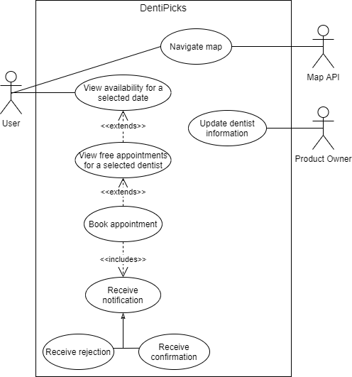
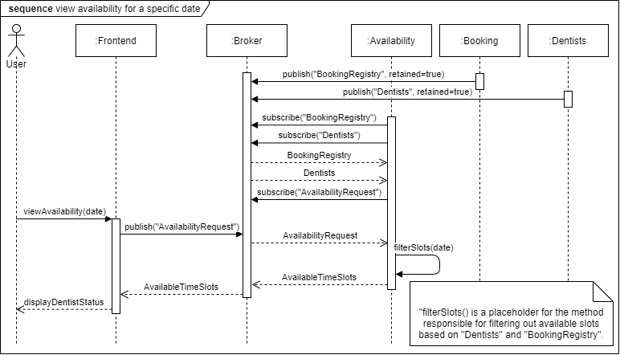
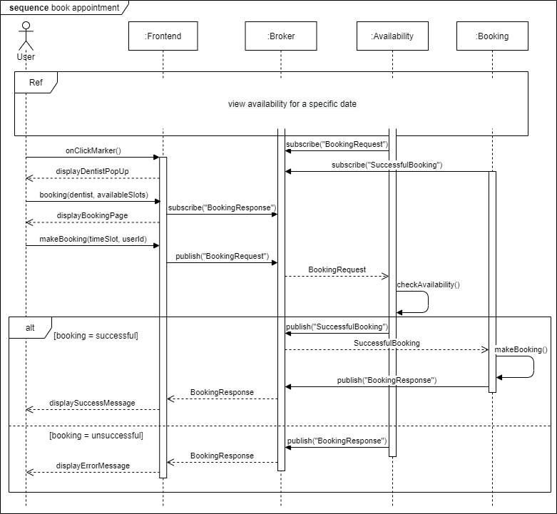
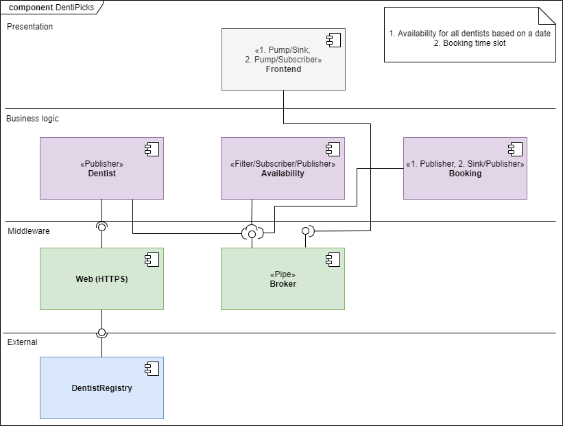
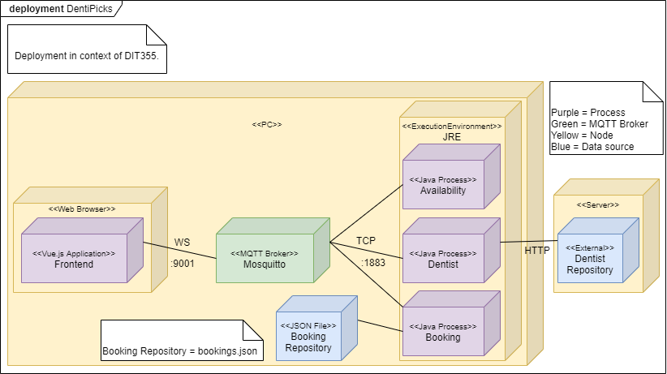

# Purpose
The purpose of this project is to create a distributed system that allows users to book dentist appointments in the Gothenburg region.

## Team Members
Fayona Cowperthwaite, guscowfa@student.gu.se

Dominique Deramat, gusderdo@student.gu.se

Shonaigh Douglas, gusdoush@student.gu.se

Negin Hashmati, gushashne@student.gu.se

Jennifer Nord, gusnorjea@student.gu.se

Victoria Vu, gusvuvij@student.gu.se

## Team Resources
* [Trello](https://trello.com/b/tLswcs2r/dit-355-2020-team-3)

# Software Requirement Specification (SRS)
## Functional Requirements
1. The system shall allow users to book dentist appointments.
   1. The system shall allow users to book dentist appointments based on time slots.
2. The system shall provide a map. 
   1. The system shall allow the map to be navigated.
3. The system shall allow users to find available appointment times.
4. The system shall provide a graphical user interface for users to use the system.
   1. The system shall visually distinguish different appointment time slots. 
5. The system shall provide booking confirmation/rejection to users.
6. The system shall keep track of free time slots.
7. The system shall keep track of the booked appointments.
8. The system shall provide a way for the dentist information to be updated. 

## Non-functional Requirements
1. The system shall be fault tolerant.
    1. The system shall be capable of appropriately handling standard failures, such as wrongly formatted data inputs or out of bounds inputs for the defined interfaces.
    2. The system’s resource-handling shall be mindful, e.g. stopped components must unsubscribe from the MQTT broker fulfilling the contract.
    3. The system shall be able to handle large amounts of requests at the same time. 
2. The system shall be responsive.
    1. The system shall react to simultaneous bookings visually. 
3. The system shall respond to updates fast.
   1. The system shall provide a way for updates to take effect within 10 minutes of their publication.

## Constraints
1. The system shall consist of at least four distributed components.
     1. The system components shall have no knowledge about the physical location of other components.
     2. The system component shall not depend on other components residing at a specific physical location.
2. The system shall be ready for final release on 5 January 2021.
3. The system shall use a combination of architectural styles.
4. The system shall use a middleware based on the Message Queue Telemetry Transport (MQTT) protocol.
   1. The system booking requests and responses are to be handled through MQTT.
5. Dentists will be unavailable for booking appointments for 1 hour and also 30 minutes per day due to breaks.
6. Dental appointments must be 30 minutes in length and start on the hour or half past the hour.
7. Requests and responses need to follow the format in the provided JSON files.
8. Users will be able to select a date and time when booking their appointments. 
9. Updates to the dentist component will not happen more than twice per day.
   1. Already existing bookings should not be affected by shorter opening hours or decrease in number of available dentists.
   2. The id’s of the dental offices shall remain consistent.

# Software Architecture Document (SAD)

## Description of the Conceptual Design of the Architecture
For older versions of the diagrams, please see the /Diagrams folder.

### Use case diagram version 3

### Sequence diagram for viewing availability for a specific date

### Sequence diagram for booking an appointment

### Component diagram version 3

### Deployment diagram version 2

### Assumptions
* Dentists will have lunch from 12:00-13:00
* Dentist will have their fika breaks from 15:00-15:30

### Design decisions
* Single-page web app front-end rather than a mobile-based front-end

### Architectural Styles
* Publish-Subscribe for the communication between the components

### How the Conceptual Design is Mapped Onto Implementation/Technologies
TBD 

#### Technologies
* Vue.js for frontend
* Bootstrap for frontend
* Java for backend
* Eclipse Paho
   * Java
   * JavaScript
* Eclipse Mosquitto

# Program Management Report (PMR)
* Scrum
   * Kanban board
   * Roles: Scrum master
   * Stand-up meetings on work days
* [Code of Conduct](https://git.chalmers.se/courses/dit355/2020/group-3/documentation/-/blob/master/CodeOfConduct.md) acts as a team contract and states our expectations, policies and procedures, and consequences
* [Useful links](https://git.chalmers.se/courses/dit355/2020/group-3/documentation/-/blob/master/UsefulLinks.md) is a list of links deemed useful for the development of the project
* Work to be done during the sprint will be decided during a Sprint Planning Meeting
* Schedule for the week will be decided during a weekly team meeting

See [Trello board](https://trello.com/b/tLswcs2r/dit-355-2020-team-3) for detailed schedule and work tasks carried out in each sprint.

## Sprint 1
* Week 1: Work Monday, Wednesday, Thursday
* Week 2: Work Monday, Wednesday, Thursday

## Sprint 2
* Week 1: Work Monday, Wednesday, Thursday
* Week 2: Work Monday, Wednesday, Thursday

## Sprint 3
TBD

## Sprint 4
TBD
