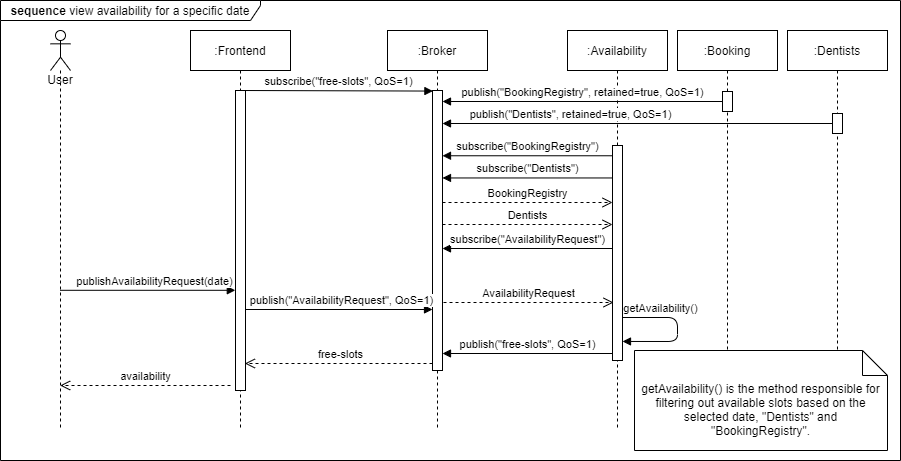

# Purpose
The purpose of this project is to create a distributed system that allows users to book dentist appointments in the Gothenburg region.

## Team Members
Fayona Cowperthwaite, guscowfa@student.gu.se

Dominique Deramat, gusderdo@student.gu.se

Shonaigh Douglas, gusdoush@student.gu.se

Negin Hashmati, gushashne@student.gu.se

Jennifer Nord, gusnorjea@student.gu.se

Victoria Vu, gusvuvij@student.gu.se

## Team Resources
* [Trello](https://trello.com/b/tLswcs2r/dit-355-2020-team-3)

# Software Requirement Specification (SRS)
## Functional Requirements
1. The system shall allow users to book dentist appointments.
   1. The system shall allow users to book dentist appointments based on time slots.
2. The system shall provide a map. 
   1. The system shall allow the map to be navigated.
   2. The system shall allow the map to visually display an indication of availability to the user.
3. The system shall allow users to find available appointment times.
4. The system shall provide a graphical user interface for users to use the system.
   1. The system shall visually distinguish different appointment time slots. 
5. The system shall provide booking confirmation/rejection to users.
6. The system shall be able to show free time slots.
7. The system shall keep track of the booked appointments.
8. The system shall provide a way for the dentist information to be updated. 
9. The system shall include a request generator in order to enable stress-testing of the system.

## Non-functional Requirements
1. The system shall be fault tolerant.
    1. The system shall be capable of appropriately handling standard failures, such as wrongly formatted data inputs or out of bounds inputs for the defined interfaces.
    2. The system’s resource-handling shall be mindful, e.g. stopped components must unsubscribe from the MQTT broker fulfilling the contract.
    3. The system shall be able to handle large amounts of requests at the same time. 
2. The system shall be responsive.
    1. The system shall react to simultaneous bookings visually (preferably without requiring an active refreshing of the interface by the user).
3. The system shall respond to updates fast.
   1. The system shall provide a way for updates to take effect within 10 minutes of their publication.

## Constraints
1. The system shall consist of at least four distributed components.
     1. The system components shall have no knowledge about the physical location of other components.
     2. The system component shall not depend on other components residing at a specific physical location.
2. The system shall be ready for final release on 5 January 2021.
3. The system shall use a combination of architectural styles.
4. The system shall use a middleware based on the Message Queue Telemetry Transport (MQTT) protocol.
   1. The system booking requests and responses are to be handled through MQTT.
5. Dentists will be unavailable for booking appointments for 1 hour and also 30 minutes per day due to breaks.
6. Dental appointments must be 30 minutes in length and start on the hour or half past the hour.
7. Requests and responses need to follow the format in the provided JSON files.
8. Users will be able to select a date and time when booking their appointments. 
9. Updates to the dentist registry will not happen more than twice per day.
   1. Already existing bookings should not be affected by shorter opening hours or decrease in number of available dentists.
   2. The ids of the dental offices shall remain consistent.

# Software Architecture Document (SAD)

## Description of the Conceptual Design of the Architecture
For older versions of the diagrams, please see the /Diagrams folder.

### Use case diagram version 4

This is a use case diagram with two actors represented, a User and the Leaflet Map API. It shows the main use cases they are involved in. 

### Sequence diagram for viewing availability for a specific date version 3

This a sequence diagram showing what happens in the system when a user selects a date on the calendar. It shows all the involved components and the interactions between them.

### Sequence diagram for booking an appointment version 3

This a sequence diagram showing what happens when a user makes a booking. It shows all the involved components and the interactions between them.

### Component diagram version 3

This is a component diagram showing all the components involved in the system and how they use each other. It reflects the architectural styles we have chosen by listing the components’ roles in context of the two featured use cases. The diagram is structured following a layered style, it separates the components amongst the four layers.

### Deployment diagram version 2

This is a deployment diagram that shows where each component is being executed when the program is running. It also lists the transport protocols being used in the system to transfer data. 

### Quality of Service Flowchart 

This is a quality of service flowchart showing the QoS levels set between the various sender and receiver relationships in the system. We have chosen to implement a QoS level of 1 everywhere in the system because due to the nature of the system we felt a level of 0 was too minimal and a level of 2 too slow for our users. Level 1 offered a good balance between ensuring messages are being received and providing a streamlined user experience. 

### Assumptions
* Dentists will have lunch for an hour in the middle of their work day.
* Dentists will have their fika breaks in the first half hour of their work day.

### Design decisions
* Single-page web app front-end rather than a mobile-based front-end.
* Whole website is one page, user is able to view availabilities and make bookings on the same page
* Mapbox is used to display the map
* Leaflet is used to display the pins and provide other functionality because it has more user-friendly documentation than Mapbox
* Availability as its own component, we determined early on that the appointment availability was important and decided to have the filtering logic separate from Booking
* For fault tolerance, we chose the circuit breaker because it is reactive. This means it would be able to adapt to what is happening in the system at any given time.

### Architectural Styles
* Publish-Subscribe for the communication between the components.
* Pipe and filter for booking validation and generation of available booking slots

### How the Conceptual Design is Mapped Onto Implementation/Technologies

One of our drivers is resilience since we have to make sure that the system is fault tolerant. 
Furthermore, our other drivers were compulsory requirements given to us by the product owners: using a broker, having four components, using publish-subscribe as one of the architectural styles. 

One of our forces is the group member’s knowledge of certain technologies. We chose to work with technologies that we have used before and are comfortable with, even if there are other technologies that might suit the system better. This leads to another one of our forces: time. Since the system has to be delivered by a certain date, we did not feel that we had the time to properly research and learn new technologies to use for this system. 

The initial use case diagram was created to get an overview of what functions the system should have. As the system evolved, the diagram was updated to reflect the requirement changes, and also our new design decisions. 

Because of the project requirement of having four components, and the functionality of the system, we created the following components: Dentist, Booking, Availability, and Frontend. These requirements impacted what responsibilities and functionality we gave the different components. 

We knew from the start that we were going to use publish-subscribe since using a middleware based on the MQTT protocol was a requirement for this project. This would be our core architectural style as this is used by all of the components in the system. 

Pipe and filter was introduced later as we realized that we needed something that would combine the information from the booking registry and dentist registry to generate the free time slots for a certain dentist and date, as well as validating the booking requests before publishing them for the booking component to use.

#### Technologies
* Vue.js for frontend
* Bootstrap for frontend
* Java for backend
* Eclipse Paho
   * Java
   * JavaScript
* Eclipse Mosquitto
* MQTT Explorer for logging
* Leaflet
* Resilience4J
* Mapbox

# Program Management Report (PMR)
* Scrum
   * Stand-up meetings on work days
    * Project work is organized into 4 sprints
   * Kanban board is used on Trello to display the tasks and assigned team members
      * Columns for overall backlog, sprint backlog, in progress, merge request/review, completed during each sprint, and discarded.
        * The merge request/review column is where tasks connected to a merge request that required a review and testing by other team members would be placed. 
        * The discarded column is for tasks we believed were necessary but were later rejected but we wanted to keep track of ideas and work produced so did not want to delete them.
   * Roles: Scrum master
     * Each team member took turns being the scrum master and it was decided that the role would cycle every Monday
     * A decision was made to remove the role of product owner after the first week as we felt that the person did not get to do anything extra since they were merely a proxy for the product owners. 
   * Stand-up meetings on days designated for project work to discuss the work performed and blockers encountered for each sub-team

* [Code of Conduct](https://git.chalmers.se/courses/dit355/2020/group-3/documentation/-/blob/master/CodeOfConduct.md) acts as a team contract and states our expectations, policies and procedures, and consequences
* Work to be done during the sprint will be decided during a Sprint Planning Meeting with notes taken to record the results of the meeting
* Schedule for the week will be decided during a weekly team meeting, taking into account team member availability

See [Trello board](https://trello.com/b/tLswcs2r/dit-355-2020-team-3) for detailed schedule and work tasks carried out in each sprint.

## Sprint 1
* Week 1: Work Monday, Wednesday, Thursday
* Week 2: Work Monday, Wednesday, Thursday

## Sprint 2
* Week 1: Work Monday, Wednesday, Thursday
* Week 2: Work Monday, Wednesday, Thursday

## Sprint 3
* Week 1: Work Monday, Wednesday, Thursday
* Week 2: Work Monday, Wednesday, Thursday

## Sprint 4
* Week 1: Work Monday, Tuesday, Wednesday
* Week 2: Work Monday, Tuesday, Wednesday, Thursday, Friday, Saturday, Sunday
* Week 3: Work Monday, Tuesday
